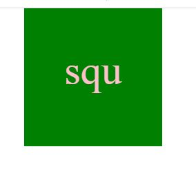

# SVG-Generator
  ## Description
  My motivation behind creating this svg logo was to save some time by using one script for various shapes. This node.js application allows users to enter text, text color, shape and shape color. svg file named logo.svg is created. Once valid inputs are entered, a confirmation  "Generated logo.svg" is displayed in the command line, to let users know that svg is ready.  Users have the option of selecting one shape out of Circle, Triangle, or Square.

  ## Sample link: 
  https://github.com/Nehaps29/svg-builder/blob/main/sample.svg

  ## Short Video Link showing how it is generated: 
  https://drive.google.com/file/d/1BwkMbHqHUMGHCVbmhOooNlaY0oQflgI-/view

  ## Picture of generate logo
  
  

  ## Table of Content

  - [Installation](#installation)
  - [Usage](#usage)
  - [Contribution Details](#contribution-details)
  - [Test Instructions](#test-instructions) 
  - [License](#licenses)
  - [Contact](#contact)
  
  

  ## Installation: 
  Node.js, Inquirer (8.2.4), jest (28.1.3) 
  ## Usage:
  to create logo (svg file type)
  ## Contribution Details: 
  Neha Sabannavar, Rutgers TA, Xpert Learning Assistant, AskBCS
  ## Test Instructions: 
  - Node index.js to generate the logo 
  - npm run test to run the test cases

  ## Licenses: 
  MIT
      
  https://opensource.org/licenses/MIT 

  
  ## Contact: 
  Below mentioned is my github profile link 

  ## Github: https://github.com/nehaps29
 
